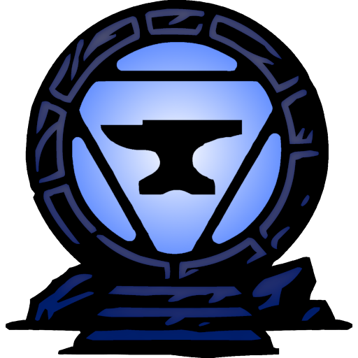
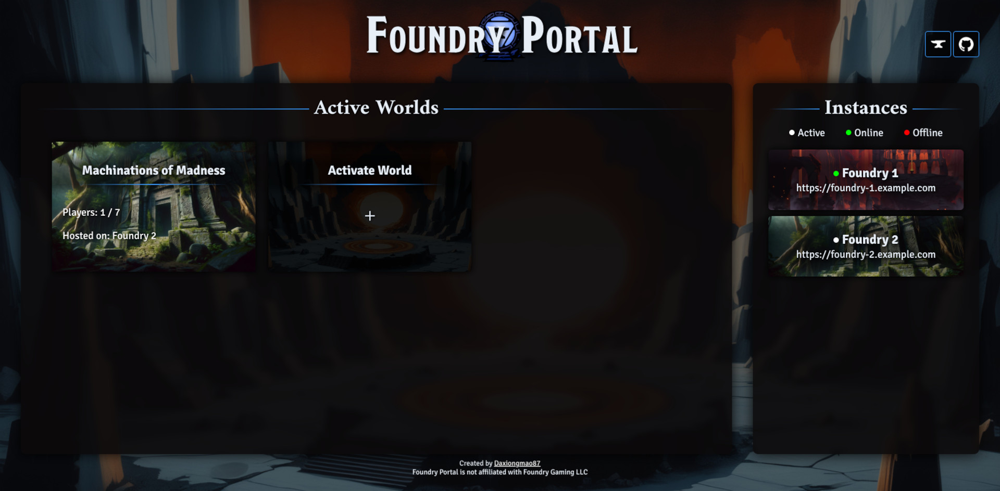

<p align="center"><p>
<p align="center"></p>

**Foundry Portal** is a web frontend for multiple [Foundry Virtual Tabletop (VTT)](https://foundryvtt.com/) instances. It provides real-time status updates of each instance, displays active worlds, and (optionally) offers seamless world activation across shared data environments.

## Features

- **Real-Time Monitoring**: Keeps track of the status (`offline`, `online`, `active`) of each configured Foundry instance.
- **Active Worlds Display**: Showcases currently active worlds with details like player counts and hosting instances.
- **Shared Data Mode**: Enables an "Activate World" button when instances share the same data folder, allowing users to activate worlds across any available instance.
- **Dynamic Updates**: Utilizes a background scheduler to refresh instance statuses at regular intervals without manual intervention.
- **Responsive Design**: Optimized for various screen sizes to ensure a consistent user experience across devices.

## Screenshot
<p align="center"><p>
  
## Prerequisites

Before setting up Foundry Portal, ensure you have the following installed on your system:

- **Python 3.7+**
  - `pip`
  - `venv` (optional, but recommended)
- **Google Chrome Browser**
- **ChromeDriver** compatible with your Chrome version
  - [Download ChromeDriver](https://developer.chrome.com/docs/chromedriver/downloads)
  - Ensure `chromedriver` is in your system's PATH or specify its location in the code.


## Installation

1. **Clone the Repository**

   ```bash
   git clone https://github.com/daxiongmao87/foundry-portal.git
   cd foundry-portal
   ```

2. **Create a Virtual Environment (Optional but Recommended)**

   ```bash
   python3 -m venv venv
   source venv/bin/activate  # On Windows: venv\Scripts\activate
   ```

3. **Install Dependencies**

   Run:

   ```bash
   pip install -r requirements.txt
   ```

   **Note**: If you encounter issues with `selenium`, ensure that the ChromeDriver version matches your installed Chrome browser version.

## Running With Docker
1. **Clone the Repository**

   ```bash
   git clone https://github.com/daxiongmao87/foundry-portal.git
   cd foundry-portal
   ```

2. **Build the image**

   ```
   docker build -t foundry-portal .
   ```

3. **Start a Docker container**

   ```
   docker run -d -p 5000:5000 \
   -v /path/to/your/config.yaml:/app/config.yaml \
   --name foundry_portal_container foundry-portal
   ```
   Ensuring that you replace "/path/to/your/config.yaml" with a path on your host to a config file. You can use config.template.yaml from this repo as a starting point.


## Configuration

1. **Copy the Configuration Template**

   ```bash
   cp config.template.yaml config.yaml
   ```

2. **Edit `config.yaml`**

   Open `config.yaml` in your preferred text editor and configure the settings:

   ```yaml
   shared_data_mode: false  # Set to true if all instances share the same data folder

   instances:
     - name: "Foundry 1"  # Descriptive name for the first Foundry instance
       url: "https://url.to/your/foundry/instance/1"  # URL of the first Foundry instance
     - name: "Foundry 2"  # Descriptive name for the second Foundry instance
       url: "https://url.to/your/foundry/instance/2"  # URL of the second Foundry instance
   ```

   - **`shared_data_mode`**: 
     - **`true`**: Enables the "Activate World" button, allowing activation across shared data instances.
     - **`false`**: Disables the "Activate World" button; instances operate independently.

   - **`instances`**: 
     - List each Foundry instance with a unique `name` and accessible `url`.

## Running the Application

1. **Start the Server**

   Launch the Flask application by running:

   ```bash
   python app.py
   ```
   
   This will start the Flask development server on `http://127.0.0.1:5000`.
  
   **Optional:** To make the portal accessible from other devices on your network, run:

   ```bash
   python app.py --host=0.0.0.0
   ```

   **Caution:** Running the Flask development server with `--host=0.0.0.0` exposes it to your local network. **It is highly recommended that you do not use the development server in a production environment.** For production deployments, consider using a production-ready web server like Gunicorn or uWSGI.

2. **Access the Portal**

Open your web browser and navigate to `http://127.0.0.1:5000` (or replace `127.0.0.1` with your server's IP address if accessible externally) to view the Foundry Portal dashboard.

## Usage

- **Active Worlds**: View all currently active worlds across your Foundry instances. Click on a world card to navigate directly to the active world's session.
- **Instance Status**: Monitor the status of each configured Foundry instance. Status indicators:
  - **Active**: Instance is actively hosting a world.
  - **Online**: Instance is online but not actively hosting a world.
  - **Offline**: Instance is not reachable.
- **Activate World**: If `shared_data_mode` is enabled, use the "Activate World" button to redirect to any available online instance to activate a world.

## Troubleshooting

- **Selenium WebDriver Issues**:
  - Ensure that ChromeDriver is installed and matches your Chrome browser version.
  - Verify that ChromeDriver is in your system's PATH. If not, specify its path in `app.py` where the WebDriver is initialized.

- **Configuration Errors**:
  - Ensure `config.yaml` adheres to proper YAML syntax.
  - Verify that all instance URLs are correct and accessible from the server running the portal.

- **Port Conflicts**:
  - If port `5000` is already in use, modify the `app.run()` line in `app.py` to use a different port:

    ```python
    app.run(debug=True, port=5001)
    ```

## Contributing

Contributions are welcome! Please fork the repository and submit a pull request with your enhancements or bug fixes.

## License

This project is licensed under the [MIT License](LICENSE.txt).

## Acknowledgements

- Developed by [Daxiongmao87](https://www.github.com/Daxiongmao87).
- Foundry Portal is not affiliated with Foundry Gaming LLC.
